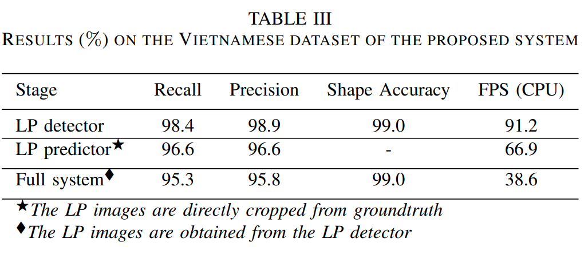
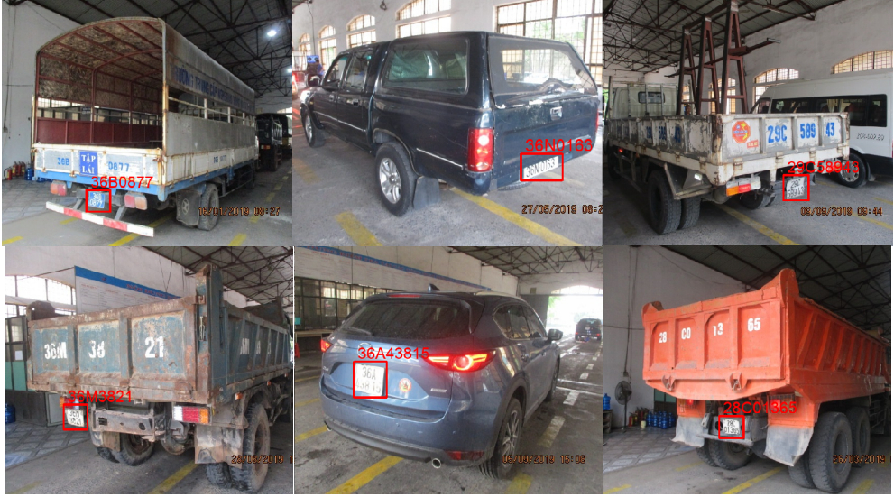

# VNLP (Vietnamese license plate dataset)

## 1. Description of VNLP dataset
<div style='text-align: justify;'>

We have manually created a large Vietnamese LP dataset (VNLP) composed of around 37,300 images. The dataset can be freely downloaded [here](https://drive.google.com/drive/folders/19OnlE0gFXEMPyngxRZ980d4z0fGQ-C7T?usp=sharing).
Most of the images have been taken at a Transportation Registration Center in Vietnam. The LP images are captured by a camera mounted at a fixed position during the period of one year. Each LP image contains n characters with 6 ≤ n ≤ 9. The sizes of LP images are considerably varying in the ranges: 30 < width < 638 and 26 < height < 240, that raises difficulty for the LP detector and predictor. Each image is carefully annotated to support the following groundtruth: the coordinates of each LP in the means of bounding box representation and the LP characters. Furthermore, the dataset is divided into two collections with respect to the LP shape type: one-row subset (19,085 images) and two-row subset (18,215 images). For training the detection model, the two subsets are merged and then randomly divided as follows: 80% for the training part, 5% for validation, and 15% for the testing part. On the other hand, we have trained two instances of the prediction CNN model with respect to the two subsets by using the same data splitting ratio: 80%/5%/15% (i.e., training/validation/testing).
</div>

## 2. An advanced system for layout-invariant license plate detection and recognition
<div style='text-align: justify;'>
We have developed a system for layout-invariant license plate detection and recognition. The proposed system, as illustrated in Figure 2, is composed of two main components: LP detection and LP prediction. The detector takes the input as an image with the size of 384×384×3 and outputs the LP image patches and LP shape types. Here, each LP image is assigned with a shape type: either rectangle (i.e., one-row label) or square (i.e., two-row label). Next, the LP image is resized to 320×64×3 or 160×128×3 with respect to the LP shape type of rectangle or square. To handle the variable lengths of LPs, the LP predictor is designed to predict n_max characters given an input LP. In our experiments, we set n_max = 10 which is appropriate for the LP layouts of many countries or regions. In the next parts, we will describe these components in detail.
</div>

## 3. Experimental results on the VNLP dataset
<div style='text-align: justify;'>
Table III presents the precision and recall of the LP detector,
LP predictor and the full system. In addition, we also provide
the accuracy of predicting the shape type of LPs (i.e. square or
rectangle) as well as the inference times on CPU environment.
As can be seen, the proposed LP detector is capable of cor-
rectly detect the LPs with a high level of precision (+98.9%),
while also achieving nearly perfect score (99.0%) on the task
of shape classification. The detection time is about 91.2 FPS
on a CPU machine.
</div>


<div style='text-align: justify;'>
To justify the true performance of the character recognition
model, we have applied the LP predictor on the LP image
patches that are directly cropped from groundtruth. The ob-
tained results are very interesting with the recognition accuracy
of 96.6% and the inference speed at 66.9 FPS. When feeding
the detection results to the recognition model, the overall
performance of the full system is still encouraging in the
means of precision and recall scores (+95.3%). The inference
speed is about 38.6 FPS, indicating that a real-time application
of this work is practicable. Figure 6 shows visually several
examples of our full system. As can be observed, despite the
significant distortion of input images (e.g., low resolutions,
diverse layout, noise), the proposed system still successfully
produces correct results.
</div>
<br>
<div>
<i>Examples of our correct results on Vietnamese LP dataset: detected
LPs (red boxes) and recognized text showed at the top of the box:</i>
</div>




## 4. Citations
<span style="color: red"> <b> Please cite the following papers when using the dataset VNLP. </b> </span>
```
[1] Thi-Anh-Loan Trinh, The Anh Pham, and Van-Dung Hoang (2022). "Layout-invariant license plate detection and recognition". International 
Conference on Multimedia Analysis and Pattern Recognition (MAPR2022), pp. 1-6.

[2] TA Pham (2023). "Effective deep neural networks for license plate detection and recognition". The Visual Computer, Vol. 39, No. 1, pp. 927-941.
```
The papers can be downloaded from [here](https://drive.google.com/drive/folders/1CCDEQ4ydZmhrTa7rgq9DDpVHv8ZZ5Zpi?usp=sharing).
